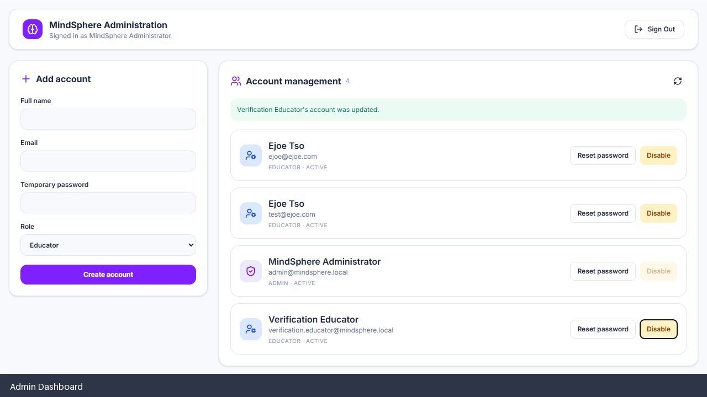
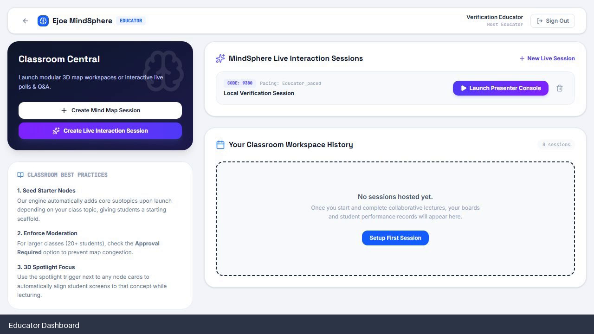
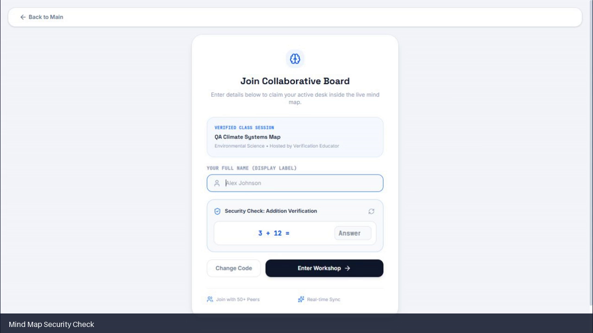

<div align="center">

# EzMindSphere

### Visual mind mapping, live interaction and classroom intelligence

[](https://ezmindsphere.ejoetso.com)
[](docs/INSTALLATION.md)
[](docs/ACTIVATION.md)

[Product site](https://ezmindsphere.ejoetso.com) · [Installation](docs/INSTALLATION.md) · [Activation](docs/ACTIVATION.md) · [Implementation](docs/IMPLEMENTATION.md)

</div>

## Product demos

### [▶ Watch the EzMindSphere implementation overview](docs/videos/EzMindSphere-implementation-overview.mp4)

<p align="center">
  <a href="docs/videos/EzMindSphere-implementation-overview.mp4"></a>
</p>

| Educator experience | Student experience |
| --- | --- |
| [](docs/videos/EzMindSphere-educator-demo.mp4) | [](docs/videos/EzMindSphere-student-demo.mp4) |

Select a screenshot to watch or download its complete walkthrough.

EzMindSphere is a self-hosted and cloud-ready collaborative learning platform for educators, students and educational institutions. It combines visual mind maps, live classroom interaction, Poll Maker, Q&A, learning activities, QR joining, educator analytics and optional Gemini-powered learning tools.

For educational licensing, cloud implementation, integrations or collaboration, email **eozoe2025@gmail.com**.

## Copyright and educational usage

Copyright © 2026 Ejoe Tso. All rights reserved.

Eligible schools, colleges, universities, training centres and non-profit educational institutions may request a free institution licence for teaching, research and internal educational use. Resale, paid redistribution, white-label distribution and commercial hosted services require written permission.

See [LICENSE.md](LICENSE.md) for complete terms. For an activation key, email **eozoe2025@gmail.com** with the institution name, type, country, contact person and intended educational use.

## Default educator account

The first launch creates this local educator account:

- Username: `ezmindsphere`
- Password: `admin@123`

Change deployment credentials before exposing a production installation publicly. Administrator credentials are configured separately through environment variables.

## Platform activation

Every new self-hosted installation must be unlocked using an authorised activation key. The first successful activation creates `data/license-activation.json` in persistent storage.

The repository contains only SHA-256 activation-key hashes. Raw activation keys are never committed publicly. Docker Compose mounts `./data` at `/app/data`, allowing activation and application data to survive container rebuilds.

Read the complete [activation and key-request guide](docs/ACTIVATION.md).

## Capabilities

- Separate administrator, educator and student experiences
- Collaborative 2D and 3D mind maps
- Live interactive teaching sessions
- Poll Maker with multiple-choice questions and instant results
- Q&A, memos, reactions, voting and moderated contributions
- Dynamic QR joining using the current network or public address
- Mobile-responsive student participation
- Educator dashboard with active students, exams, sessions and clock
- AI-assisted summaries, quizzes, idea clustering and learning support
- Session summaries and exportable study resources
- Activation-key licensing and institutional deployment controls
- Self-hosted Docker deployment and managed-cloud architecture support

## Requirements

Choose either:

- Docker Engine 24+ with Docker Compose, or
- Node.js 22+ and npm 10+

A modern Chromium-based browser is recommended. Remote production deployments should use HTTPS.

## Quick start with Docker

```bash
git clone https://github.com/ejoetso/EzMindSphere.git
cd EzMindSphere
cp .env.example .env
docker compose up --build -d
```

Open `http://localhost:3000`, enter an activation key, and sign in with the educator account.

Useful operations:

```bash
docker compose ps
docker compose logs -f ezmindsphere
docker compose down
```

## Native local development

```bash
npm install
cp .env.example .env
npm run dev
```

Open `http://localhost:3000`. The development server listens on all interfaces, allowing devices on the same network to use `http://YOUR_LAN_IP:3000`.

Validation commands:

```bash
npm run lint
npm run build
npm audit
```

## Configuration

| Variable | Purpose | Default |
| --- | --- | --- |
| `APP_URL` | Public HTTPS application address and QR-link base URL | automatic local address |
| `GEMINI_API_KEY` | Optional Gemini API key for AI features | empty |
| `ADMIN_EMAIL` | Initial local administrator | `admin@mindsphere.local` |
| `ADMIN_PASSWORD` | Initial administrator password | change before production |
| `EDUCATOR_USERNAME` | Built-in educator username | `ezmindsphere` |
| `EDUCATOR_PASSWORD` | Built-in educator password | `admin@123` |
| `JWT_SECRET` | Signs authentication tokens | must be changed in production |
| `LICENSE_KEY_HASHES` | Optional comma-separated activation hashes | packaged hash file |

Never commit a real `.env` file. It is excluded from Git and Docker build context.

## User workflows

### Educator

1. Activate the institution installation and open EzMindSphere.
2. Sign in through the educator portal.
3. Review active-student, exam, session and time indicators.
4. Create a mind-map or live interaction session.
5. Share the session code or dynamic QR link.
6. Launch Poll Maker, Q&A, brainstorming or other activities.
7. Moderate contributions and review results in real time.
8. Generate summaries, quizzes and study resources after the session.

### Student

1. Open the platform or scan the educator’s QR code.
2. Enter a name and session code.
3. Join from a phone, tablet or desktop browser.
4. Contribute ideas, answer polls, vote and ask questions.
5. Follow the shared visual map and educator-led activities.

### Administrator

1. Sign in through the administrator portal.
2. Create and manage educator accounts.
3. Review account roles and platform access.
4. Maintain activation, environment and deployment settings.

## Production implementation

### Self-hosted

1. Run the Docker service behind an HTTPS reverse proxy such as Caddy, Nginx, Traefik or Cloudflare Tunnel.
2. Set `APP_URL` to the final HTTPS address.
3. Replace default passwords and `JWT_SECRET` using protected environment secrets.
4. Preserve and back up the `data` volume.
5. Ensure the proxy forwards WebSocket upgrade headers.

### Managed cloud

The static product site is hosted on Netlify. The complete interactive platform requires a persistent Node/WebSocket runtime and durable database; Netlify Functions alone are not sufficient for live sessions. A production cloud implementation should use:

- Netlify or another CDN for the frontend
- A persistent Node.js service for Express and WebSockets
- PostgreSQL or equivalent durable storage
- Optional Redis for multi-instance session routing
- HTTPS and secure environment-secret management

## Architecture notes

- React and Vite provide the responsive client.
- Express provides authentication, licensing and application APIs.
- A persistent WebSocket server synchronises live sessions and mind maps.
- Local installations store application state under `data/`.
- A single instance is recommended until shared database and message-broker infrastructure is configured.

## Security checklist

- Change all default credentials before public deployment.
- Generate a long random `JWT_SECRET`.
- Serve the platform through HTTPS.
- Keep raw activation keys and `.env` files outside source control.
- Back up the persistent data volume.
- Add authentication rate limiting for internet-facing installations.
- Review student privacy, retention and consent requirements.
- Restrict administrator access appropriately.

## Support and collaboration

For free educational-institution licensing, commercial use, managed cloud implementation, product integration or collaboration, contact **eozoe2025@gmail.com**.
